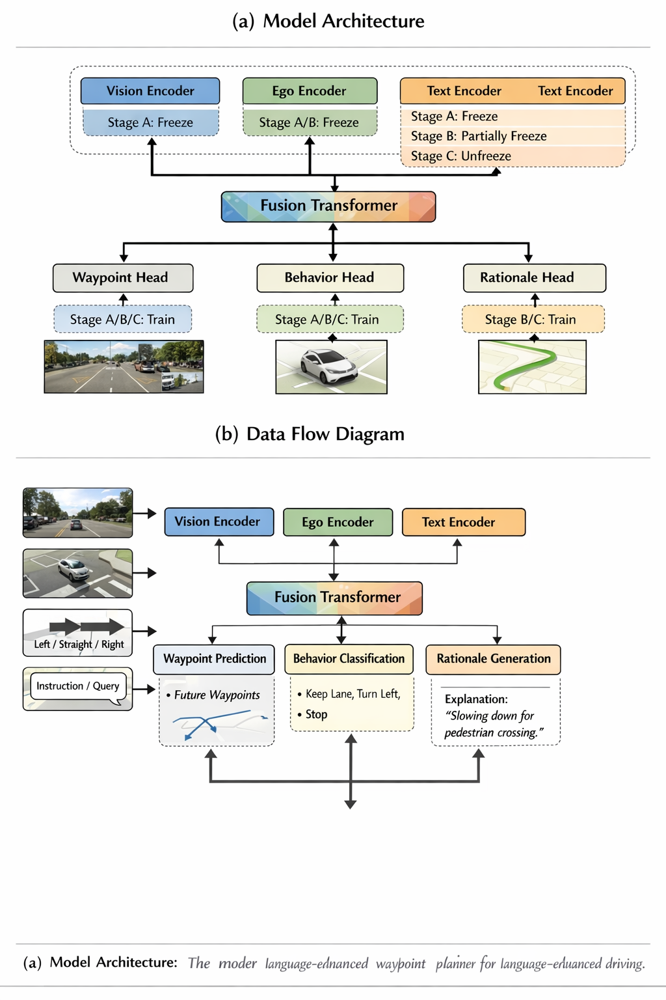

# language_waypoint_planner

`language_waypoint_planner` 是一个面向研究原型的离线训练管线，用于从多相机图像序列、ego 历史状态、route command 和可选语言输入中预测：

- 未来 5 秒二维 waypoints
- 离散驾驶行为标签
- 一句简短解释文本

当前版本优先交付可运行的离线训练与评估流程，便于后续扩展到 CARLA / Bench2Drive 闭环系统。





## 目录结构

```text
language_waypoint_planner/
  configs/
  data/
  models/
  losses/
  train/
  eval/
  sim/
  scripts/
tests/
```


## 功能概览

- `WaymoE2EDataset`、`DriveLMDataset`、`Talk2CarDataset`
- 缺失标签不丢样本，统一通过 `valid_masks` 做 mask
- `VisionEncoder` 支持 `resnet50` 和轻量 `lite_vit`
- `EgoEncoder` 支持 `mlp` 和 `transformer`
- `TextEncoder` 支持离线 `hash` 模式，以及可选 HuggingFace 后端
- `FusionTransformer` 融合视觉、ego、route、语言 token
- `WaypointHead`、`BehaviorHead`、`RationaleHead`
- 训练支持混合精度、梯度裁剪、checkpoint、TensorBoard hook
- 评估支持 ADE/FDE、行为准确率/F1、解释文本占位指标和可视化导出

## 安装

最小依赖：

```bash
cd /Users/edward0112/Desktop/AgentRec/WorldVLA/WaypointPlanner
python3 -m pip install -e .
```

可选依赖：

- `transformers`：启用 HuggingFace 文本编码器
- `PyYAML`：解析常规 YAML；未安装时默认解析 JSON-compatible YAML
- `tensorboard`：启用 TensorBoard 日志

## 配置说明

配置位于 `language_waypoint_planner/configs/`：

- `minimal_debug.yaml`：默认合成数据 debug
- `waymo_pretrain.yaml`：Waymo 风格 waypoint + behavior 预训练
- `multitask_vla.yaml`：Waymo + DriveLM + Talk2Car 多任务训练

为了减少环境依赖，当前仓库内的 `.yaml` 文件使用 JSON-compatible YAML 语法，`PyYAML` 缺失时仍可正常加载。

## 训练

最小 debug 运行：

```bash
cd /Users/edward0112/Desktop/AgentRec/WorldVLA/WaypointPlanner
PYTHONPATH=. python3 -m language_waypoint_planner.scripts.run_minimal_debug
```

Waymo 风格预训练：

```bash
PYTHONPATH=. python3 -m language_waypoint_planner.train.train_waymo
```

多任务语言增强训练：

```bash
PYTHONPATH=. python3 -m language_waypoint_planner.train.train_multitask
```

自定义配置：

```bash
PYTHONPATH=. python3 -m language_waypoint_planner.train.train_multitask --config /abs/path/to/config.yaml
```

## 数据格式

manifest 样本采用 JSON 或 JSONL，字段对应 `BaseDrivingSample`：

```json
{
  "images": [["front_t0.png", "front_left_t0.png", "front_right_t0.png"]],
  "ego_hist": [[-1.0, 0.0], [-0.5, 0.0]],
  "velocity": [[1.2], [1.1]],
  "acceleration": [[0.0], [-0.1]],
  "route_command": "straight",
  "language_input": "keep going straight",
  "target_waypoints": [[0.4, 0.0], [0.8, 0.0]],
  "target_behavior": "keep_lane",
  "target_rationale": "maintaining lane while following the planned route",
  "valid_masks": {"waypoints": true, "behavior": true, "rationale": true}
}
```

说明：

- `images` 必须是 `[T][num_cameras]` 的路径列表
- 缺失标签可以直接置空，或通过 `valid_masks` 显式控制
- 默认训练配置使用 3 个相机：`front`、`front_left`、`front_right`

## 评估输出

评估阶段会导出：

- `ADE/FDE`
- 行为 `accuracy/F1`
- 简单 rationale exact match 占位指标
- 可视化图像，包含预测轨迹、GT 轨迹、route command、预测 rationale

输出目录默认位于：

```text
outputs/<run_name>/
```

## 测试

```bash
cd /Users/edward0112/Desktop/AgentRec/WorldVLA/WaypointPlanner
PYTHONPATH=. python3 -m unittest discover -s tests -v
```

## 扩展 TODO

- `sim/carla_bridge.py`
  TODO: 接 CARLA 传感器包到离线 planner 输入格式
- `sim/carla_bridge.py`
  TODO: 接 Bench2Drive 闭环控制接口
- `losses/preference.py`
  TODO: 接入 Waymo 风格多条未来轨迹偏好打分
- `models/text_encoder.py`
  TODO: 为 HuggingFace 文本编码器补充本地缓存检查和更细粒度 tokenizer 策略
